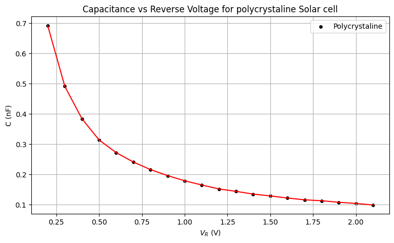
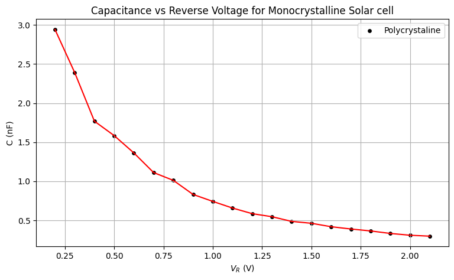

# <h1> <b> Lock in Amplifier using ExpEYES/SEElab </b> </h1>

This repository contains the works done by Anantha Padmanabhan and Parshathi S Mohan in the building of the Lock in amplifier using Expeyes/seelab. This is part of the course P442-Integrated laborotary (open lab) @ NISER.

<h2> About Lock in Amplifier and Expeyes/SEELab </h2>

The lock-in amplifier is a type of amplifier that can extract a signal with a known carrier wave from an extremely noisy environment. It is able to recover signals with a very low signal-to-noise ratio. The lock-in amplifier is able to do this by using a reference signal to recover the signal of interest. The reference signal is used to modulate the signal of interest. The lock-in amplifier then uses a technique called phase-sensitive detection to recover the signal of interest.

ExpEYES (Experiments for Young Engineers and Scientists) is a hardware & software framework for developing science experiments. It is developed by the Inter-University Accelerator Centre, New Delhi. It is a hardware and software framework for developing science experiments. It is designed to lower the cost of laboratory equipment for educational institutions. It is a small, open source, and low-cost data acquisition and control device, which can be used for performing experiments in physics, chemistry, and biology.

<h2> Experiments with SEELab/Expeyes </h2>

Here we are using the ExpEYES/SEELab along with its python interface/Library to build a low cost lock in amplifier. The main experiemnts done using this setup are its calibration, Measurement of Low Resistance, and CV profiling of the Solar Cell. 

<h2> Repository Structure </h2>

<ul>
<li>The file  LIA_Final contains the main function of the Lock in amplifier in which it returns the amplitude of the required signal.</li>
<li>The file LIA_CAL.py containes the modified LIA for the specific case of the calibration.</li>
<li>The file LIA_LR.py containes the modified LIA for the specific case of the measurement of low resistance.</li>
<li>The file LIA_CV.py containes the modified LIA for the specific case of the CV profiling of the Solar Cell. Here the function is modified so as to get the in-phase and the quadrature components of the required signal as it is needed to calculate the capacitance using the autophasing method</li>
<li>The folder Data contains the data sets and results obtained for each of the above mentioned experiments.</li>
<li>The two ipynb files containes the structure of the Lock in amplifier and its testinig with plots at each step</li>

</ul>

<h2> Verifying plots of the working of Lock In Amplifier  </h2>

The plot shown below is the working of the amplifier. The input signal is a 1kHz sine wave of 3V amplitude along with some noise which. The signal is completely generated in the python itself with random numbers. Here the virtual amplification is set to 10.

 

The plot shown below is the working of the amplifier. The input signal is a 1kHz sine wave of 3V amplitude generated from the WG of the SEELab. Here the virtual amplification is set to 1.

 

<h2> Sample CV plot obtained using the Lock in Amplifier  </h2>

The below image shows the C-V plot of a Polycrystalline Solar Cell obtained from the lock in amplifier.

 

The below image shows the same C-V plot but of a Monocrystalline Solar Cell.

